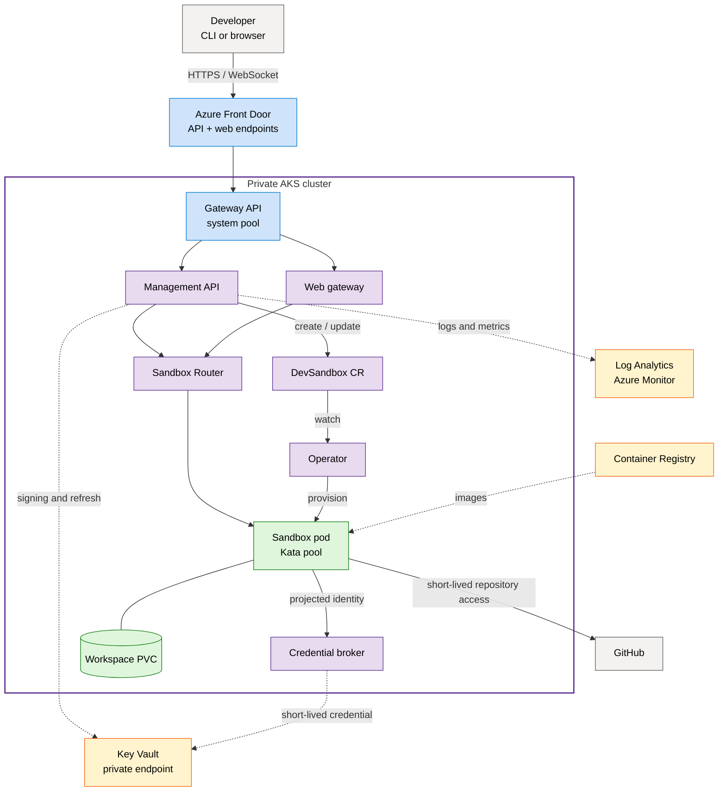
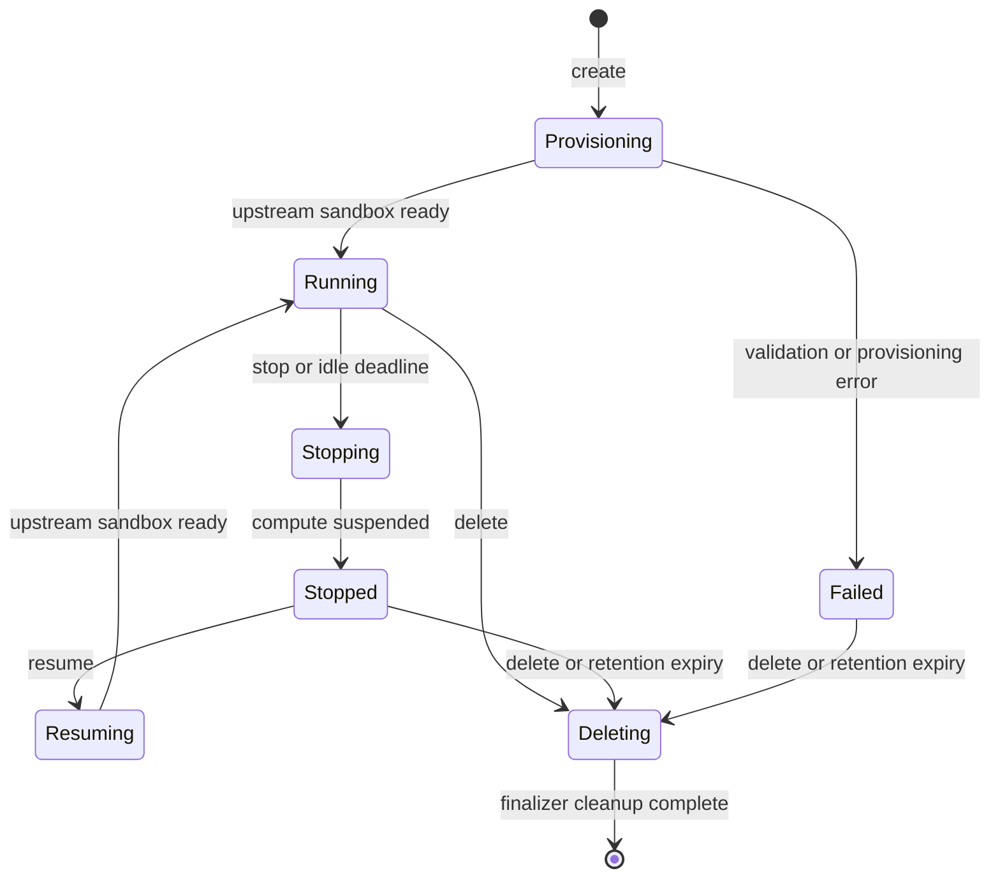
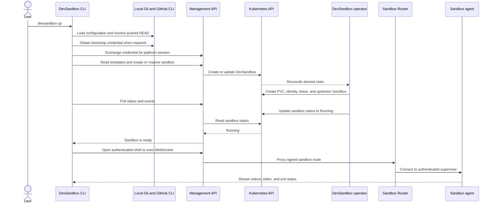

# DevSandbox architecture

DevSandbox is an internal developer platform that creates isolated, persistent
development environments on Azure Kubernetes Service (AKS). This page explains
the deployed topology and the main runtime flows. See
[DEVSANDBOX_SPEC.md](../DEVSANDBOX_SPEC.md) for the complete product
specification.

## Azure deployment

`infra/foundation.bicep` creates the resource group and composes the
resource-group deployment in `infra/main.bicep`. The deployment creates:

- A private AKS cluster with an Azure Linux system pool and an autoscaling Kata
  VM isolation user pool.
- Azure Front Door Standard with separate API and web endpoints.
- A virtual network and AKS subnet whose network security group allows origin
  traffic from `AzureFrontDoor.Backend`.
- Azure Container Registry for management and curated sandbox images.
- A private Key Vault for route signing keys and GitHub refresh credentials.
- User-assigned managed identities and AKS workload identity federation.
- Log Analytics, Container Insights, managed Prometheus metrics, and resource
  diagnostic settings.

The AKS API has no public FQDN. Deployment and verification therefore use AKS
Run Command rather than direct public access to the Kubernetes API.

## Runtime components

| Component | Responsibility |
| --- | --- |
| DevSandbox CLI | Resolves configuration and repository state, calls the management API, waits for lifecycle transitions, and provides shell, exec, job, port, VS Code, and Copilot entry points. The VS Code AI template exposes Copilot CLI and OpenCode inside the browser editor terminal. |
| Management API | Authenticates users, enforces owner authorization, exposes the public API, manages `DevSandbox` resources, renews activity, and issues signed connectivity claims. |
| Web gateway | Exchanges one-time browser credentials and proxies authenticated VS Code browser traffic through Sandbox Router. |
| DevSandbox operator | Reconciles templates, quotas, PVCs, per-sandbox service accounts, activity leases, and upstream Agent Sandbox resources. |
| Credential broker | Verifies projected Kubernetes identities and sandbox ownership bindings before returning a short-lived, user-scoped GitHub credential. |
| Sandbox Router | Resolves upstream sandbox pods and proxies management API or web gateway traffic to the sandbox agent. |
| Sandbox init | Initializes an empty workspace or clones an exact Git commit once, including configured LFS and submodules. |
| Sandbox agent | Runs the authenticated supervisor for interactive shells, commands, jobs, tunnels, and template services. |

Management components run in `devsandbox-system` on the system node pool.
Sandbox resources run in `devsandbox-workloads` on nodes tainted and labelled
for Kata VM isolation.

## Why Kata VM isolation

> [!IMPORTANT]
> Kata and Ubuntu are not alternatives at the same layer. Ubuntu can be the
> sandbox image or guest operating-system environment; Kata provides the
> isolation boundary in which that environment runs.

A conventional Kubernetes container on an Ubuntu or Azure Linux node shares
the host kernel with every other container on that node. That is appropriate
for trusted application services, but it is a weak boundary for a development
platform that deliberately runs repository scripts, package installers,
generated commands, and other potentially untrusted code.

Kata runs each sandbox in a lightweight virtual machine with its own guest
kernel while retaining the Kubernetes pod API and scheduling model. If code
compromises the sandbox operating system, the additional VM boundary reduces
the likelihood and blast radius of crossing into the AKS host or another
developer's sandbox.

| Standard container | Kata-isolated sandbox |
| --- | --- |
| Shares the node kernel | Uses a separate guest kernel |
| Lower startup time and resource overhead | Stronger workload boundary with additional overhead |
| Suited to trusted platform services | Suited to agent-driven and untrusted development workloads |
| A container escape can expose the shared node | A sandbox compromise must also cross the VM boundary |

The trade-off is additional startup latency, memory use, dedicated node-pool
capacity, and operational complexity. A dedicated VM or node for every sandbox
could provide a similar boundary, but at greater provisioning and management
cost. Kata is used here because it combines VM-style isolation with the
existing Kubernetes lifecycle. See [Workload isolation](security.md#workload-isolation)
for the threat model and the controls Kata does not replace.

## Sandbox lifecycle

The top-level `DevSandbox` custom resource is the lifecycle owner. Its
finalizer coordinates deletion of the upstream Sandbox, workspace storage,
service account, activity lease, jobs, and quota reservation.

Stopping removes sandbox compute and managed jobs but retains the PVC for the
configured retention period. Resuming recreates compute around the same
workspace. Activity leases and live managed jobs delay idle shutdown.

## How the CLI interacts with the platform

Command syntax and all supported variations are documented in
[Use the DevSandbox CLI](../README.md#use-the-devsandbox-cli).

Configuration precedence is command flags, process environment, the selected
environment file, and built-in defaults. The CLI resolves an explicit
repository or the current Git worktree and verifies that the selected commit is
available from GitHub before creation.

The CLI stores only the short-lived DevSandbox platform session in the native
OS credential store. In the local static PoC profile, the GitHub CLI credential
is read for the configured account and exchanged in process memory.

## Connectivity and trust boundaries

- Front Door exposes distinct HTTPS API and web endpoints. Gateway routes also
  require the deployment's exact `X-Azure-FDID` value.
- The AKS Gateway sends API traffic only to the management API and browser
  traffic only to the web gateway.
- The API and web gateway are the only callers allowed into Sandbox Router.
- Sandbox ingress is default-deny; only Sandbox Router and kubelet health
  probes are allowed.
- Each sandbox uses a dedicated service account with no Role or RoleBinding.
- The projected broker token has a dedicated audience, a ten-minute lifetime,
  and is bound to the sandbox service account and pod.
- Repository credentials are brokered to a memory-backed runtime volume and
  are not persisted in the workspace.

The current PoC does not restrict sandbox egress, and Front Door reaches the
source-restricted AKS origin over HTTP. See [Security](security.md) for the
complete control and residual-risk summary.

## Sources of truth

| Concern | Source |
| --- | --- |
| Azure resources | [`infra/`](../infra/) |
| Kubernetes topology and policies | [`deploy/kustomize/`](../deploy/kustomize/) |
| Public API | [`api/openapi.yaml`](../api/openapi.yaml) |
| Custom resources | [`api/v1alpha1/`](../api/v1alpha1/) |
| Runtime implementation | [`cmd/`](../cmd/) and [`internal/`](../internal/) |
| Detailed product decisions | [`DEVSANDBOX_SPEC.md`](../DEVSANDBOX_SPEC.md) |

## Related documentation

- [Development guide](development.md)
- [Security](security.md)
- [Operations](operations.md)
- [Validation and deployment](validation.md)
