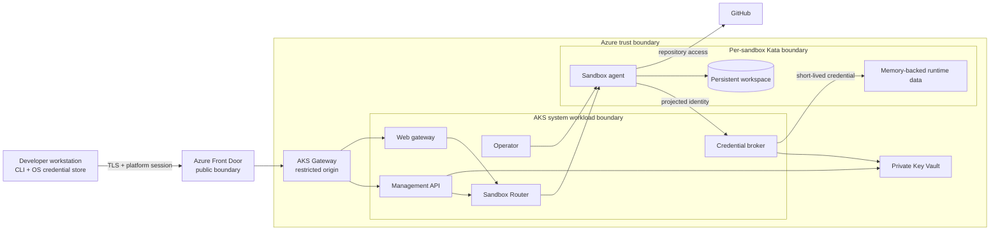

# DevSandbox security

DevSandbox is a proof of concept, not a production security baseline. This page
documents its current trust boundaries, implemented controls, assumptions, and
known residual risks. It does not replace a deployment-specific threat model or
security review.

## Assets and trust boundaries

The primary protected assets are source code and workspace data, GitHub
credentials, DevSandbox platform sessions, Key Vault signing and refresh
material, container images, and control over sandbox lifecycle operations.

| Boundary | Security intent |
| --- | --- |
| Workstation to Front Door | Browser-trusted TLS and a short-lived, signed platform session. |
| Front Door to AKS | Source network restriction and exact Front Door profile header matching. |
| Gateway to management services | Separate API and web listeners, routes, services, and hostnames. |
| System to sandbox workloads | Sandbox Router is the only admitted application path into sandbox pods. |
| Sandbox to credential broker | Dedicated projected token audience and binding checks across service account, pod, sandbox name, UID, and owner. |
| Per-sandbox runtime | Kata VM isolation, dedicated identity, PVC, in-memory runtime volume, and no Kubernetes RoleBinding. |

## Identity and authorization

- The API authenticates a GitHub user and issues a signed DevSandbox platform
  session. Normal sessions have a 15-minute lifetime.
- Every user-facing sandbox operation is owner-authorized. The product has no
  administrator or break-glass API.
- The CLI caches only the platform session in Windows Credential Manager,
  macOS Keychain, or Linux Secret Service.
- The API, broker, and bootstrap jobs use distinct user-assigned managed
  identities federated to dedicated Kubernetes service accounts.
- Key Vault custom roles separate API signing/credential-rotation operations
  from broker credential operations.
- Each sandbox service account is unique and receives no Role or RoleBinding.
- The broker accepts only a projected service-account token with audience
  `devsandbox-credential-broker`, then verifies the live service account, pod,
  `DevSandbox`, UIDs, and owner before returning a credential.

The local `static-validation` mode is an explicit PoC alternative when an
interactive GitHub App registration cannot be completed. It binds one GitHub
account, reads the token from a Kubernetes Secret volume, and uses a longer
platform session. It is not the production authentication design.

## Workload isolation

> [!IMPORTANT]
> DevSandbox executes code that the platform cannot assume is trustworthy.
> Repository hooks and build scripts, dependencies, tests, generated agent
> commands, and development tools all run inside the sandbox. Stronger-than-
> container isolation is therefore a core security requirement, not only a
> performance or packaging choice.

Ordinary containers share the AKS node kernel. Non-root execution, seccomp,
dropped capabilities, RBAC, and network policy reduce attack surface, but they
do not remove that shared-kernel trust relationship. A successful kernel
exploit or container escape could expose the node and other sandboxes scheduled
on it.

Sandbox pods are scheduled only to the tainted Kata user pool and request
`kata-vm-isolation`. Kata places each sandbox in a lightweight VM with a
separate guest kernel, adding a hardware-virtualized boundary between
untrusted workload code, the AKS host, and neighboring sandboxes. An Ubuntu-
based development environment can still run inside that boundary; changing the
container base image to Ubuntu alone would not provide the same isolation.

The pod and management workloads also run as non-root, use the runtime-default
seccomp profile, disallow privilege escalation, and drop Linux capabilities.
Management containers use read-only root filesystems where their runtime
permits it. These controls remain necessary defense in depth even with Kata.

The operator creates a dedicated PVC and service account for each sandbox.
Workspace storage survives stop/resume, while `/run/devsandbox` is a
memory-backed `emptyDir`. Stop removes compute and managed jobs; delete removes
the top-level resource and lets the finalizer clean up the workspace, identity,
leases, upstream resources, and quota reservation.

Templates pin the image digest captured by the `DevSandbox` resource. The
operator rejects a template version or digest mismatch before provisioning.

Kata does not make code inside a sandbox inherently trusted. It does not
prevent that code from using credentials legitimately made available to the
sandbox, accessing its workspace, or exfiltrating data through allowed egress.
It also does not replace image security, patching, identity controls, network
policy, credential minimization, monitoring, or hypervisor and host security.

Running without Kata is reasonable only when workloads and users are trusted,
the sandbox receives no valuable credentials, or an equivalent dedicated
VM/node boundary exists. Using ordinary shared-kernel containers for this
multi-user, agent-driven threat model would require an explicit acceptance of a
materially larger cross-sandbox and node-compromise risk.

## Network and data protection

- The AKS control plane is private and has no public FQDN.
- Key Vault disables public network access and is reached through a private
  endpoint and private DNS.
- Both Kubernetes namespaces default-deny ingress.
- Network policies permit only the expected Gateway-to-service,
  service-to-Router, workload-to-broker, Router-to-sandbox, and health-probe
  paths.
- The broker uses TLS inside the cluster.
- Sandbox port forwarding binds only to `127.0.0.1` and traverses an
  authenticated WebSocket; it does not create a public Kubernetes Service.
- Front Door, AKS, and application diagnostics are sent to Log Analytics.

Audit records contain allow-listed identity, sandbox, repository, lifecycle,
and session metadata. They exclude tokens, commands, stdout, stderr, and file
contents. See [Operations](operations.md#audit-investigation) for the query
entry point.

## Credential handling

| Credential | Handling |
| --- | --- |
| DevSandbox platform session | Signed by the Key Vault route key and stored by the CLI only in the native OS credential store. |
| GitHub CLI bootstrap credential | Retrieved for the configured account and held in process memory for the platform exchange. It is not written to `.env`. |
| GitHub App refresh material | Stored and rotated through private Key Vault access using the API managed identity. |
| Sandbox broker identity | Ten-minute projected Kubernetes token with a dedicated audience, mounted read-only. |
| Sandbox GitHub credential | Returned only after broker binding validation and written to the memory-backed runtime directory, not the persistent workspace. |
| Copilot and OpenCode process authentication | Wrapper processes validate the current sandbox GitHub credential and inject it only into the child process. OpenCode disables repository-provided configuration and plugins, uses `OPENCODE_AUTH_CONTENT`, and redirects all XDG and temporary paths to a dedicated memory-backed runtime volume; neither tool writes authentication to the workspace PVC. |
| Browser entry credential | One-time exchange material; the browser receives it in the URL fragment rather than query parameters or workflow output. |

Secret values must not appear in preflight output, workflow outputs, generated
configuration, audit records, or test artifacts. `.env` is intentionally
secret-free.

## Supply-chain controls

- GitHub Actions are pinned to full commit SHAs.
- The vendored Agent Sandbox release has a recorded SHA-256 checksum and pinned
  controller image digest.
- Sandbox Router is built from the source commit matching that release.
- Kubernetes manifests reject mutable `latest` image tags during static
  validation.
- Curated and management image versions are declared in
  `images/versions.json`; published tags are immutable.
- Go tests, OpenAPI consistency, Bicep compilation, Kustomize rendering, image
  metadata checks, and static security assertions run in the pull-request
  gates.

## Known PoC limitations

| Concern | Current control | Residual risk and production direction |
| --- | --- | --- |
| Sandbox egress is unrestricted | Kata isolation, owner binding, and inbound NetworkPolicy | A compromised workload can reach arbitrary external endpoints. Add explicit egress policy, DNS controls, and approved destinations. |
| A GitHub token exists in sandbox process memory | Short-lived brokering, memory-backed runtime files, redacted logging | Code executing inside the sandbox can use the owner's token. Reduce token scope and lifetime, prefer fine-grained delegated access, and isolate credential use from arbitrary processes. |
| Front Door reaches the AKS origin over HTTP | `AzureFrontDoor.Backend` source restriction, exact `X-Azure-FDID`, separate hostnames | Origin traffic is not end-to-end encrypted. Use an HTTPS origin with managed certificate validation. |
| Static validation uses an owner-bound token | Explicit mode, Secret volume, account binding, no `.env` persistence | This is unsuitable for multi-user production use. Require GitHub App authentication and remove the static provider. |
| Security policy is primarily preventive at deployment time | Static assertions, E2E isolation tests, audit events, metrics | Add continuous policy enforcement, image scanning, runtime detection, and periodic access reviews. |

## Production hardening priorities

1. Restrict sandbox egress and define approved repository, package, and
   telemetry destinations.
2. Replace the HTTP Front Door origin with validated end-to-end TLS.
3. Remove static authentication and complete the multi-user GitHub App model.
4. Minimize repository credential scope, exposure, and lifetime.
5. Add image and dependency vulnerability scanning with deployment policy
   enforcement.
6. Define workspace encryption, backup, retention, deletion, and recovery
   requirements for the target data classification.
7. Run a deployment-specific threat model, penetration test, and incident
   response exercise before production use.

## Security review checklist

- Confirm the deployment uses GitHub App mode rather than static validation.
- Confirm the private AKS API, private Key Vault endpoint, workload identities,
  and expected role assignments.
- Verify the Kata runtime class, node placement, per-sandbox identity, security
  context, RBAC, quotas, and NetworkPolicies.
- Verify Front Door routes, profile identifier, origin restriction, and TLS
  behavior.
- Run static and deployed security validation and inspect all `Blocked` results.
- Review audit ingestion, alerts, credential rotation, and cleanup behavior.
- Record acceptance and ownership for every remaining PoC limitation.

## Related documentation

- [Architecture](architecture.md)
- [Development guide](development.md)
- [Operations](operations.md)
- [Validation and deployment](validation.md)
- [Detailed security validation](../DEVSANDBOX_SPEC.md#145-security-validation)
